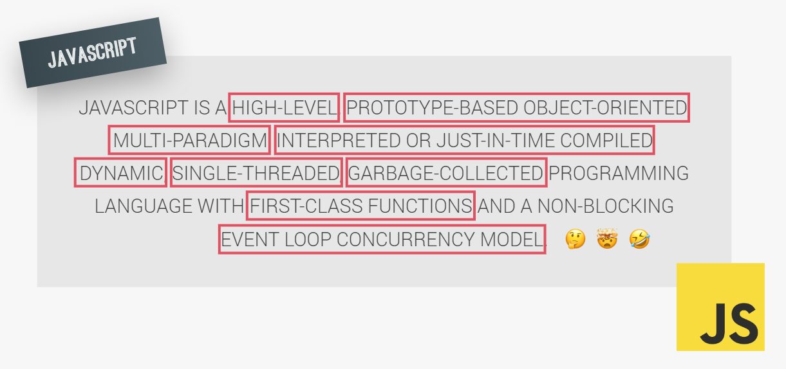
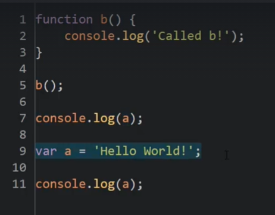
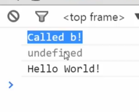
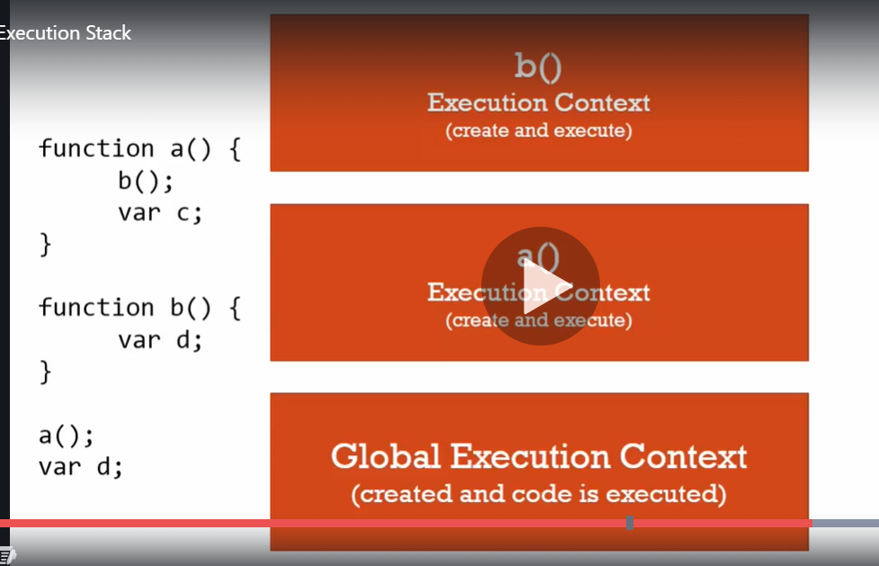
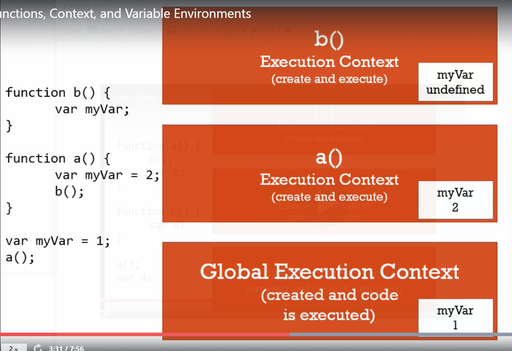
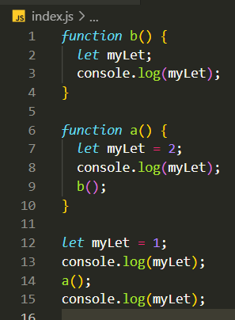
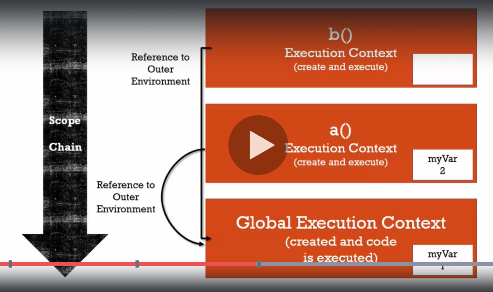
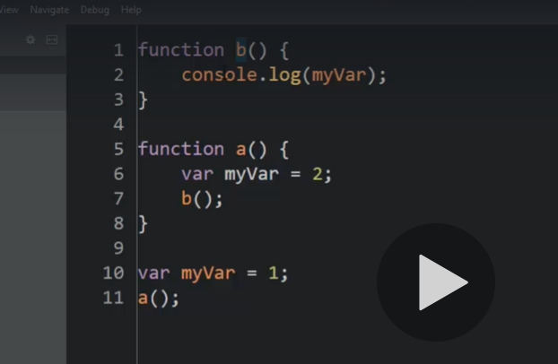
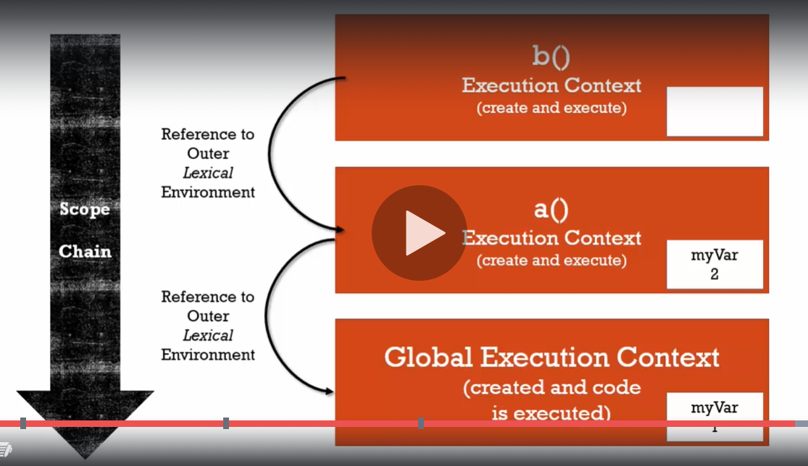
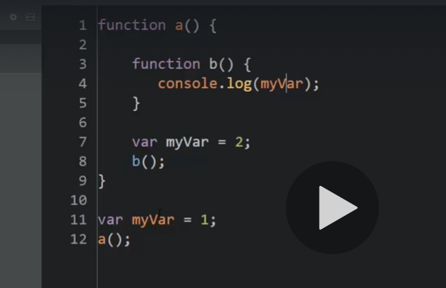

# What the f-ck is Javascript

NhanNguyen

some little note by myself to remind what i did learn

i think i do not understand about JS as i think

---

## Things worth to review:

| No. | Content                                       |
| --- | --------------------------------------------- |
|     |                                               |
| 1   | [Execution Context](#execution-context)       |
| 3   | [Variable Environment](#variable-environment) |
| 4   | [Lexical Environment](#lexical-environment)   |
| 5   | [The Scope Chain](#the-scope-chain)           |
| 6   | [Execution Context](#execution-context)       |
| 6   | [Execution Context](#execution-context)       |
| 6   | [Execution Context](#execution-context)       |

---

## Syntax Parser

JS runtime will compiles you code word by word in every time you run JS code to machine languages that computer can understand
We write the abstract code that allow human readable => under the hood that somebody very smart do something to compile the code to machine language

<!--  -->

---

## Lexical Environment:

it mean talking about where our code is written - where our code is phisically sit and what surrounds it - where it was born.
it determine where things live, where things sit in memory, and how they will connect to each other.

---

## Execution Context:

Execution context is a wrapper of all your lexical environment - all your code in other words.
there are lot of lexical environment. Which one is currently running is managed via execution context

- When JS file is runing Global execution context will create two thing: (actually JS engine do it)
  1. Global object
  1. "this" keywords
  1. the reference to the outer environment - (for scoping)

---

## Execution context: Creation and Hoisting

1.  **Creation Phrase:** - Hoisting

    - Before your code execute line by line =>
    - The JS engine will scan the code and Setup memory space for variables and function - to prepare for execution phrase
    - All the variable and function will be setup a placeholder. Entire function will be place in memory.
    - But variable only setup placeholder(memory space) and its value set to **undefined** - not the value - the value will be set in the execution phrase if it have.

    - **UNDEFINED**
      - is a special value in JS
      - it mean that the value have take up place in memory but never assign to a value - it is that compiler add more when it run my code in [Syntax Parser](#syntax-parser)

---

2.  **Execution Phrase**

     ||| ||| 

    <!--  |  -->

    - Every function when it involve it will **create it own execution context** and JS engine will put this execution context to the Execution Stack (Stack follow "First in last out")
    - The order lexically doesn't matter - it mean the order that you write your code does not matter - the order in the **Stack** is matter
    - In this image bellow: although function a is above function b => it normal because in the creation phrase function already take place in memory during global execution context
    - a() - put a() to the bottom of the stack =>b() - put b() to the top of the stack=>var d => var c => var d

    

---

## Variable Environment

Every time you call a function you create it own **variable environment** in its own **execution context**
In this picture bellow: each variable are unique - distinct because it create in it its own variable environment in the function execution context

 ||| ||| 

---

## The Scope Chain

Remember when the function are involved it create the execution context put it to the **Stack** and every execution context have its own **variable environment**

When the function create it owns **execution context**=> it also create the reference to the outer environment

When you find variable in the **execution context** => JS look to the **variable environment** to find the variable => if cant found the variable => JS will look to the **referent to outer environment** which create by engine in the **creation phrase** of the **execution context**

- The **outer environment** is determine by **lexical environment** - where the code is actually written - not where the function are involved or where the function are placed in the Stack

=> more details: the outer reference (outer environment) where the function are point to is depend on where the function sits lexically

-The act of the execution context of one function go down one by one outer environment to the bottom of the Stack is call **scope chain**;
=> Scope mean: where can i access the variable

P/S: when function are called => create execution context in the Stack => execution context will create outer environment for this function => go to find where lexically or physically sit in the code

 ||| ||| 

To know how it work, remember about lexically and physically where it sit

 ||| ||| 
