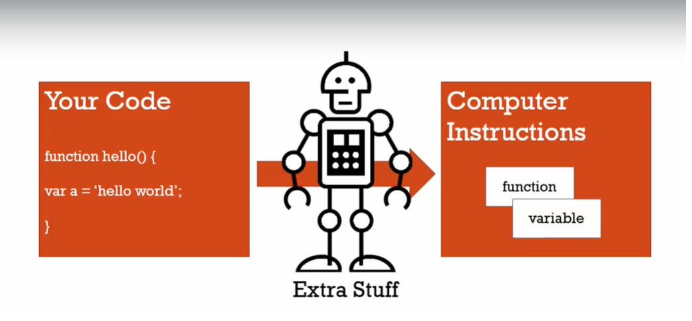

# What the f-ck is Javascript

NhanNguyen

some little note by myself to remind what i did learn

i do not understand about JS as i though


---

## Things worth to review:

| No. | Content                                                                              |
| --- | ------------------------------------------------------------------------------------ |
|     |                                                                                      |
| 1   | [Execution Context](#execution-context) - DIFFICULT                                  |
|     | [Variable Environment](#variable-environment)                                        |
|     | [Lexical Environment](#lexical-environment)                                          |
|     | [The Scope Chain](#the-scope-chain)                                                  |
|     | [Asynchronous](#asynchronous) - DIFFICULT                                            |
| 2   | [Operators](#operators) - DIFFICULT                                                  |
|     | [Comparison Operators](#comparison-operators)                                        |
|     | [Existence and Boolean](#existence-and-boolean)                                      |
| 3   | [Chapter3: Object and Function](#chapter3-object-and-function)                       |
|     | [Object and the dot](#object-and-the-dot)                                            |
|     | [Expression, Statement and Function](#expression-statement-and-function) - DIFFICULT |
| 4   | [First Class Function](#first-class-function) - DIFFICULT                            |
| 5   | [This Key Word](#this-key-word)                                                      |
| 6   | [Closure](#closure) - DIFFICULT - DIFFICULT - DIFFICULT - DIFFICULT - DIFFICULT      |
|     | [Call()-Apply()-Bind()](#call-apply-bind)                                            |
| 7   | [Functional Programing](#functional-programing)                                      |

---

## Syntax Parser

JS runtime will compiles you code word by word in every time you run JS code to machine languages that computer can understand
We write the abstract code that allow human readable => under the hood that somebody very smart do something to compile the code to machine language

<!--  -->


---

## Lexical Environment:

it mean talking about where our code is written - where our code is phisically sit and what surrounds it - where it was born.
it determine where things live, where things sit in memory, and how they will connect to each other.

---

## Execution Context:

Execution context is a wrapper of all your lexical environment - all your code in other words.
there are lot of lexical environment. Which one is currently running is managed via execution context

- When JS file is runing Global execution context will create two thing: (actually JS engine do it)
  1. Global object
  1. "this" keywords
  1. the reference to the outer environment - (for scoping)

---

## Execution context: Creation and Hoisting

1.  **Creation Phrase:** - Hoisting

    - Before your code execute line by line =>
    - The JS engine will scan the code and Setup memory space for variables and function - to prepare for execution phrase
    - All the variable and function will be setup a placeholder. **_Entire function will be place in memory include its passed parentheses_**
    - **_But variable only setup placeholder(memory space)_** and its value set to **undefined** - not the value - the value will be set in the execution phrase if it have.

    - **UNDEFINED**
      - is a special value in JS
      - it mean that the value have take up place in memory but never assign to a value - it is that compiler add more when it run my code in [Syntax Parser](#syntax-parser)

---

2.  **Execution Phrase**

     ||| ||| 

    <!--  |  -->

    - Every function when it involve it will **create it own execution context** and JS engine will put this execution context to the Execution Stack (Stack follow "First in last out")
    - The order lexically doesn't matter - it mean the order that you write your code does not matter - the order in the **Stack** is matter
    - In this image bellow: although function a is above function b => it normal because in the creation phrase function already take place in memory during global execution context
    - a() - put a() to the bottom of the stack =>b() - put b() to the top of the stack=>var d => var c => var d

    

---

## Variable Environment

Every time you call a function you create it own **variable environment** in its own **execution context**
In this picture bellow: each variable are unique - distinct because it create in it its own variable environment in the function execution context

 ||| ||| 

---

## The Scope Chain

Remember when the function are involved it create the execution context put it to the **Stack** and every execution context have its own **variable environment**

When the function create it owns **execution context**=> it also create the reference to the outer environment

When you find variable in the **execution context** => JS look to the **variable environment** to find the variable => if cant found the variable => JS will look to the **referent to outer environment** which create by engine in the **creation phrase** of the **execution context**

- The **outer environment** is determine by **lexical environment** - where the code is actually written - not where the function are involved or where the function are placed in the Stack

=> more details: the outer reference (outer environment) where the function are point to is depend on where the function sits lexically

-The act of the execution context of one function go down one by one outer environment to the bottom of the Stack is call **scope chain**;
=> Scope mean: where can i access the variable

P/S: when function are called => create execution context in the Stack => execution context will create outer environment for this function => go to find where lexically or physically sit in the code

 ||| ||| 

To know how it work, remember about lexically and physically where it sit

 ||| ||| 

---

## Asynchronous

Queue: First in First out
Stack: Last in Last out

#### This two picture bellow explain how synchronous - single thread language like JavaScript can deal with asynchronous task (like event - fetch API - timer)


---


---

---

# Chapter2: Types and Operators

---

## Dynamic Typing

We don't declare what type of data that variable holds, it figures out while the code is running - in the execution;

---

## Operators

Under the hood, operators in JS is function that accept two parenthesis - and return a value (someone built JS are writing this for us)

**+,-,\*,/,= is also function under the hood**

It mean:

```
let a = 2+3;
<!-- Equal to -->
function + (2,3){
  return // under the hood add the two parenthesis
}
```

## Operator Precedence (Độ ưu tiên của toán tử)

## Operator Associativity

define what order of the operator function get called: Right to Left - Left to Right

```
let a=1,b=2,c=4;
a=b=c;
/////////////// a=4,b=4,c=4
// Associativity of this operator is Right-to-Left
// So first function = (b,c) run first and return 4
// After that, function = (a,b) run
```

---

## Coercion

Because **_JavaScript is dynamic type languages_** => it automatically under the hood **_convert/coercion_** to the value that JavaScript think it have to be

**_undefined and null is falsy value but it not equal to 0_**

## Comparison Operators

1. **Compare operators**

```
console.log(3 < 2 < 1) //return true
```

```
console.log(false < 1)
```

so when run this operators, JS will execute the first function compare (<) and return false
=> then false will be coerced to 0 because it is falsy value
=> in the end it will compare 0 < 1 and it is true

2. **Equal operators**

Best Practice: always use triple equal "==="

- With "=="
  =>>>> **it coerce one value to another type so that the two have the same type to compare - it is not like i think before**

  ```
  "3" == 3 // true -> it coerce "3" to a number and compare
  false == 0 //true -> it coerce false to 0 and compare
  null == 0 // false
  undefined == 0 // false -> null and undefined not equal to 0
  null < 1 // true -> but it is 0 in other circumstances
  "" == 0 // true
  "" == false // true -> empty string be coerced to 0
  ```

- With "==="
  =>>>> **it compare two thing: value and type - and it does not attempt to try to coerce value to another type**

## Existence and Boolean

```
if(something){
  ...//
}
```

it will coerced **something** to boolean and check if it existence
=> because all **_undefined, null, "" is represent for lack of existence_** and it return false also

---

---

# Chapter3: Object and Function

Every object have sort of address where it live in our computer memory
And it have **_references to the address or value of different properties and methods that are also sit in our computer memory._**

---

## Object and the dot

To access to member of an Object using "[] or ."
**Both of them is a operator**


1. Dot access:
   - It will automatically convert what you pass in after **dot operator** into a string
2. Square bracket:
   - It normally is a "operator function" that take one parameter

```
person = new Object();
person.address.street = "some string";
// Dot operator the accsessibility left-to-right
```

the first dot operator will run -> it will look to person object and look to the address property that reference in the computer memory -> after the first dot run, it will return an sub object -> look to the "street" property in that object like so.

---

## JSON and Object literal

JSON is use for replace XML to transport data through internet
JSON have syntax look like Object literal but every property is in the ""

JSON is technically is a _subset_ of Object literal syntax
=> every thing valid in **JSON** is also valid in **Object literal**

```
JSON.stringify(objectLiteral) //Convert object to string for JSON file
JSON.parse(jsonString) //Convert string of JSON to object literal for JS
```

---

## First Class Function

Everything we can do with others types we can do with function

Because function are special type of Object so that we cant attach property and method to function

**Function are object and the code that we written is just put into one of the property of this function object and it also invocable()**

 ||| ||| 

---

Because function are object so that we can create property for that object

 ||| ||| 

---

## Expression, Statement and Function

**_Expression:_** the units of code that return a value and it does not have to store into some thing.

1. **Expression function**

   ```
   let anonymousGreet = function (){
     //some code
   }
   ```

   The example above is the function(){} is an expression that return a value and we assign it to the variable.

   > More detail: in the creation phrase of execution context - the variable will take placeholder with undefined value in the memory. When JS reach the line of assign this variable to function object -> the variable are assign to function object and after that we can involved this variable through ()
   > **_this why function expression cant hoist_**

2. **Declaration function**

   ```
   function Greet (){
     // some code
   }
   ```

   Statement: the code that does not return any value

3. **First class function**

We can pass function expression as a parameter to another function because function are just only object in JS, and we can pass it around


So that does the code above do

> function expression will create when the log() function run, and that anonymous function expression assign its value to the "a" variable so that you can involved the "a" variable by using () - involved operator

## By Value and By Reference

1. **By Value**

Primitive type will set with difference new address in the memory and with the copy of the value


2. **By Reference**

When we assign a object b to a, it does not create a new object in the memory, the two variable just point to the same place in the HEAP.

It can easily mean that with the same object - it have two name, and one name is alias


what happen in the snippet bellow:

```
c = { greeting: "hello"}
b=c
```

the equal operator will create the new spot in the memory for the object {greeting: "hello"}
b will point to the object that c is point to in the memory this is call reference

---

## This key word

**_this key word_** in the normal function declaration will point to window object

```
function a(){
  console.log(this)
}
a()
```

**_this key word_** in this example will point to the global variable - the window

```
const c = {
  name: "Nhan",
  log: function (){
    console.log(this)
  }
}
c.log()
// this code will return object c
```

**_this key word_** inside the method in the object will point to the object that contain the method

## Argument, Parameter and Spread

in the Creation context JS engine will also create the "arguments" **_array_** for us to use

```
function greet(firstname, lastname){
  console.log(argument)
}
greet("Nhan", "Nguyen");
// return ["Nhan", "Nguyen"]
```

---

```
function greet(firstname){
  console.log(firstname)
}
greet();
// return undefined
```

this return undefined because when the function greet be called - **_the creation phrase_** take up place in the memory for that function and **_parameter of that function_** will be take up a **_placeholder_** in the memory with the value of **_undefined_**

## Immediately Involved Function Expression

Should watch the video in JS: Understanding the weird part again

```
const greeting = function(name){
  return "Hello" + name
}("Nhan")

console.log(greeting)
// return Hello Nhan
// console.log(greeting()) -> does not work because greeting is not a function
```

In the right hand of equal operator: because of the IIFE the anonymous function expression be involved immediately with the global variable and return a value as a string;

Then, equal operator assign "greeting variable" for this string.
After that the console.log receive the string - not the function

---

How to create a function and involved it at the same time

```
(function(parameter){
  /some code
}())
```

pass the **_function expression_** into the **_() operator_** to trick the syntax parser about this is the **_function expression not function statement_**. And use () to call it immediately => it called IIFE

---

## Closure

`free variable` is the variable outside the function but you still have the access to

the return of the function object (in the execution context) is different with where the function live in memory (in the creation phrase)

it mainly about the idea of **_Function return a function_**

Because function are `first-class citizen` so that it can return as a normal value

**Garbage collection**: the act of clearing all the variable is set up in the memory space when the execution context in the stack gone

> When its code is invoked, and JavaScript engine sees the whattosay variable, what does the JavaScript engine do?

> Well it goes up the scope chain.
> It find outer lexical environment reference, since it couldn't find it inside the function itself.

> And even though the execution context of that function greet is gone - was popped off the stack
> The sayHi execution context still has a reference to the variables, to the memory space of its outer environment.
> In other words, even though the greet function ended, it finished, any functions created inside of it when they are called will still have a reference to that greet function's memory - to what was in its memory, its execution context memory space.

> => and when it happen we say the execution context of the return function has closed in its outer variable
> => in other words, it still have reference to that variable even their execution context are gone

GOOD QUESTION: [Understanding Closures](https://www.udemy.com/course/understand-javascript/learn/lecture/2237544#questions/653912)


SO WHAT IS `CLOSURE` MEAN:

> Closure mean that the callback function have access to the outer variable environment even the higher-order-function are popped off the stack (gone - end).

> The JavaScript engine will always make sure that whatever function I'm running, that it will have access to the variables that it's supposed to have access to. its scope is intact.

**_WHY THE CALLBACK FUNCTION DON NOT RUN RIGHT AWAY_**

> It because the function expression return function object and store all the code inside that function in to its "code property" util facing the () operator, it will be involved and also create its own execution context, variable environment.

---


IF CAN BE ABLE TO FIGURE OUT - WATCH THE VIDEO AGAIN: [Understanding Closures](https://www.udemy.com/course/understand-javascript/learn/lecture/2562690#questions/653912)


## Let/Const and Closure

`Let/Const` is scoped to the block, so that they are called block scope variable

---

## Call()-Apply()-Bind()

function are `object` so that they can have `property and method`

- Call() method
- Bind() method
- Apply() method

1. **_bind()_** - **_CREATE A COPY OF THAT FUNCTION_**

this keyword of function object that involved bind(pointTo) will point to whatever we pass to bind method (in this case will pointTo)

```
let logName = function(){
  //some code
}
```

we can use bind() through 2 way:

```
logName.bind()
  ---
let logName = function(){
  //some code
}.bind()
```

because i want call bind method in the function object, not call bind() for the return value of that function

---

**_Apply of bind: function currying: Create a copy of a function but with some preset parameters_**

```
function multiple(a,b){
  return a*b
}

let multipleTwoNumber = multiple.bind(this, 2)

// This will permanently set the value of first parameter is 2
```

---

2. **_call()_** - decide what the this keyword of the function is **BUT IT CALL FUNCTION IMMEDIATELY**

> Apply of Call: function borrowing: call method on another function in other function

=> it have same meaning with `inheritance` of `OOP` in `Class`

```
const person1 ={
  name: "Van A",
  greeting: function (){
    console.log("hello " + this.name)
  }
}

const person2={
  name: "Van B"
}

person1.greeting.call(person2) //with return "hello Van B"

```

---

# Functional Programing

In other languages their function is not first-class citizen. There is a limitation to how much we can put into function. Limit how can you divide/segment code

JavaScript is a `first-class function` so that allow **us think and code in terms of functions.** It mean allow us to divide/segment my code to reuseable.

To segment our code in even cleaner and tighter ways. And this lets us build really clean and in some ways beautiful looking code.

It just about give our function a function and return from our function a function in purpose simplify our code over and over again


