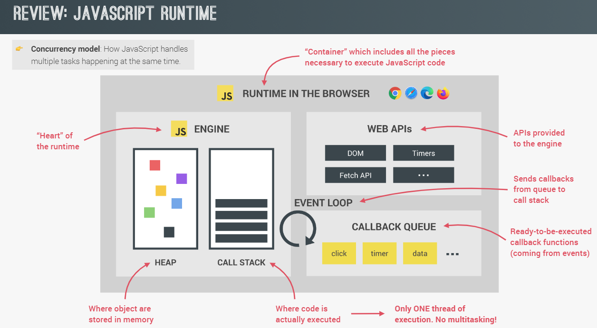

# What the f-ck is Javascript

NhanNguyen

some little note by myself to remind what i did learn

i think i do not understand about JS as i think


---

## Things worth to review:

| No. | Content                                                        |
| --- | -------------------------------------------------------------- |
|     |                                                                |
| 1   | [Execution Context](#execution-context)                        |
|     | [Variable Environment](#variable-environment)                  |
|     | [Lexical Environment](#lexical-environment)                    |
|     | [The Scope Chain](#the-scope-chain)                            |
|     | [Asynchronous](#asynchronous)                                  |
| 2   | [Operators](#operators)                                        |
|     | [Comparison Operators](#comparison-operators)                  |
|     | [Existence and Boolean](#existence-and-boolean)                |
| 3   | [Chapter3: Object and Function](#chapter3-object-and-function) |
|     | [Object and the dot](#object-and-the-dot)                      |
|     | [Coercion](#coercion)                                          |

---

## Syntax Parser

JS runtime will compiles you code word by word in every time you run JS code to machine languages that computer can understand
We write the abstract code that allow human readable => under the hood that somebody very smart do something to compile the code to machine language

<!--  -->


---

## Lexical Environment:

it mean talking about where our code is written - where our code is phisically sit and what surrounds it - where it was born.
it determine where things live, where things sit in memory, and how they will connect to each other.

---

## Execution Context:

Execution context is a wrapper of all your lexical environment - all your code in other words.
there are lot of lexical environment. Which one is currently running is managed via execution context

- When JS file is runing Global execution context will create two thing: (actually JS engine do it)
  1. Global object
  1. "this" keywords
  1. the reference to the outer environment - (for scoping)

---

## Execution context: Creation and Hoisting

1.  **Creation Phrase:** - Hoisting

    - Before your code execute line by line =>
    - The JS engine will scan the code and Setup memory space for variables and function - to prepare for execution phrase
    - All the variable and function will be setup a placeholder. **_Entire function will be place in memory include its passed parentheses_**
    - **_But variable only setup placeholder(memory space)_** and its value set to **undefined** - not the value - the value will be set in the execution phrase if it have.

    - **UNDEFINED**
      - is a special value in JS
      - it mean that the value have take up place in memory but never assign to a value - it is that compiler add more when it run my code in [Syntax Parser](#syntax-parser)

---

2.  **Execution Phrase**

     ||| ||| 

    <!--  |  -->

    - Every function when it involve it will **create it own execution context** and JS engine will put this execution context to the Execution Stack (Stack follow "First in last out")
    - The order lexically doesn't matter - it mean the order that you write your code does not matter - the order in the **Stack** is matter
    - In this image bellow: although function a is above function b => it normal because in the creation phrase function already take place in memory during global execution context
    - a() - put a() to the bottom of the stack =>b() - put b() to the top of the stack=>var d => var c => var d

    

---

## Variable Environment

Every time you call a function you create it own **variable environment** in its own **execution context**
In this picture bellow: each variable are unique - distinct because it create in it its own variable environment in the function execution context

 ||| ||| 

---

## The Scope Chain

Remember when the function are involved it create the execution context put it to the **Stack** and every execution context have its own **variable environment**

When the function create it owns **execution context**=> it also create the reference to the outer environment

When you find variable in the **execution context** => JS look to the **variable environment** to find the variable => if cant found the variable => JS will look to the **referent to outer environment** which create by engine in the **creation phrase** of the **execution context**

- The **outer environment** is determine by **lexical environment** - where the code is actually written - not where the function are involved or where the function are placed in the Stack

=> more details: the outer reference (outer environment) where the function are point to is depend on where the function sits lexically

-The act of the execution context of one function go down one by one outer environment to the bottom of the Stack is call **scope chain**;
=> Scope mean: where can i access the variable

P/S: when function are called => create execution context in the Stack => execution context will create outer environment for this function => go to find where lexically or physically sit in the code

 ||| ||| 

To know how it work, remember about lexically and physically where it sit

 ||| ||| 

---

## Asynchronous

Queue: First in First out
Stack: Last in Last out

#### This two picture bellow explain how synchronous - single thread language like JavaScript can deal with asynchronous task (like event - fetch API - timer)



---


---

---

# Chapter2: Types and Operators

---

## Dynamic Typing

We don't declare what type of data that variable holds, it figures out while the code is running - in the execution;

---

## Operators

Under the hood, operators in JS is function that accept two parenthesis - and return a value (someone built JS are writing this for us)

**+,-,\*,/,= is also function under the hood**

It mean:

```
let a = 2+3;
<!-- Equal to -->
function + (2,3){
  return // under the hood add the two parenthesis
}
```

## Operator Precedence (Độ ưu tiên của toán tử)

## Operator Associativity

define what order of the operator function get called: Right to Left - Left to Right

```
let a=1,b=2,c=4;
a=b=c;
/////////////// a=4,b=4,c=4
// Associativity of this operator is Right-to-Left
// So first function = (b,c) run first and return 4
// After that, function = (a,b) run
```

---

## Coercion

Because **_JavaScript is dynamic type languages_** => it automatically under the hood **_convert/coercion_** to the value that JavaScript think it have to be

**_undefined and null is falsy value but it not equal to 0_**

## Comparison Operators

1. **Compare operators**

```
console.log(3 < 2 < 1) //return true
```

```
console.log(false < 1)
```

so when run this operators, JS will execute the first function compare (<) and return false
=> then false will be coerced to 0 because it is falsy value
=> in the end it will compare 0 < 1 and it is true

2. **Equal operators**

Best Practice: always use triple equal "==="

- With "=="
  =>>>> **it coerce one value to another type so that the two have the same type to compare - it is not like i think before**

  ```
  "3" == 3 // true -> it coerce "3" to a number and compare
  false == 0 //true -> it coerce false to 0 and compare
  null == 0 // false
  undefined == 0 // false -> null and undefined not equal to 0
  null < 1 // true -> but it is 0 in other circumstances
  "" == 0 // true
  "" == false // true -> empty string be coerced to 0
  ```

- With "==="
  =>>>> **it compare two thing: value and type - and it does not attempt to try to coerce value to another type**

## Existence and Boolean

```
if(something){
  ...//
}
```

it will coerced **something** to boolean and check if it existence
=> because all **_undefined, null, "" is represent for lack of existence_** and it return false also

---

---

# Chapter3: Object and Function

Every object have sort of address where it live in our computer memory
And it have **_references to the address or value of different properties and methods that are also sit in our computer memory._**

---

## Object and the dot

To access to member of an Object using "[] or ."
**Both of them is a operator**


1. Dot access:
   - It will automatically convert what you pass in after **dot operator** into a string
2. Square bracket:
   - It normally is a "operator function" that take one parameter

```
person = new Object();
person.address.street = "some string";
// Dot operator the accsessibility left-to-right
```

the first dot operator will run -> it will look to person object and look to the address property that reference in the computer memory -> after the first dot run, it will return an sub object -> look to the "street" property in that object like so.

---

## JSON and Object literal

JSON is use for replace XML to transport data through internet
JSON have syntax look like Object literal but every property is in the ""

JSON is technically is a _subset_ of Object literal syntax
=> every thing valid in **JSON** is also valid in **Object literal**

```
JSON.stringify(objectLiteral) //Convert object to string for JSON file
JSON.parse(jsonString) //Convert string of JSON to object literal for JS
```

---

## First Class Function

Everything we can do with others types we can do with function

Because function are special type of Object so that we cant attach property and method to function

**Function are object and the code that we written is just put into one of the property of this function object and it also invocable()**

 ||| ||| 
